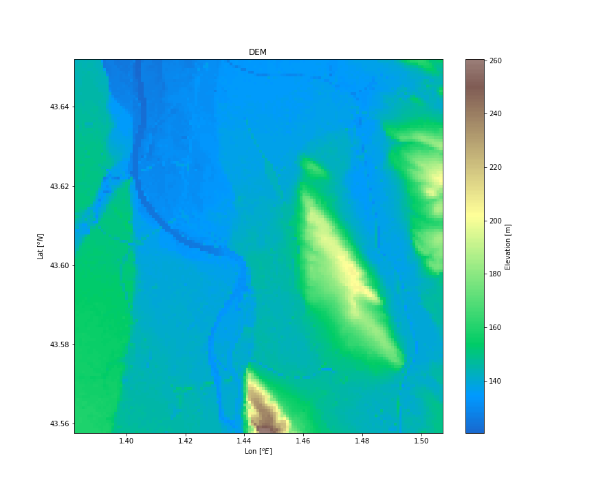
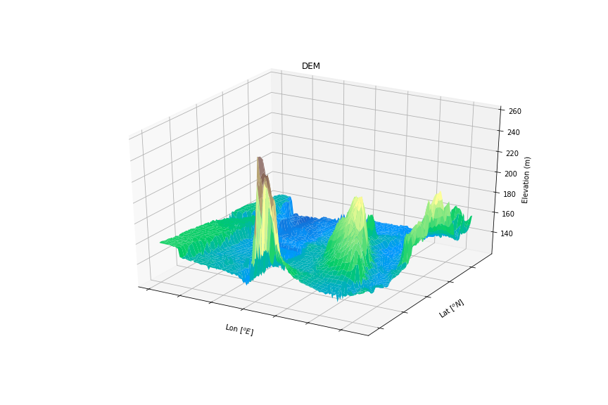

# BD ALTI Elevation

Build a local Digital Elevation Model (DEM) from IGN BD ALTI to get elevation over an area of interest

Data from IGN can be downloaded on the French [open source portal](https://www.data.gouv.fr/)

ASCII raster tiles are managed as numpy arrays

Projections and shapes are managed with [pyproj](https://github.com/pyproj4/pyproj) and [Shapely](https://pypi.org/project/Shapely/)

2D and 3D visualization of the area of interest is realized with [Matplotlib](https://matplotlib.org/)

Elevation of any point within the area (in lat,lon WGS84) is given with a [SciPy](https://www.scipy.org) interpolation

Example: digital elevation model over the city of Toulouse, France

## Running the tests

Run the demo_elevation notebook to get an example of how to use the dem library

## Built With

* [pyproj](https://github.com/pyproj4/pyproj) - Python cartographic projections and coordinate transformations library

* [Shapely](https://pypi.org/project/Shapely/) - Python package for manipulation and analysis of planar geometric objects

* [SciPy](https://www.scipy.org) - Python-based ecosystem for mathematics, science and engineering

* [Matplotlib](https://matplotlib.org/) - Python 2D plotting library

## Authors

* **Thomas Dubot** 

## License

This project is licensed under the MIT License - see the [LICENSE.md](LICENSE.md) file for details

## Acknowledgments

BD ALTI data are provided by IGN on [open source portal](https://www.data.gouv.fr/)

Thanks to [Phyks](https://phyks.me/2015/02/looking-for-altitude-opendata.html) for clearing the ground to BD ALTI parsing

Thanks to [xoolive](https://github.com/xoolive) for his carto-advices